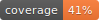

####################
Python template test
####################

.. image:: https://img.shields.io/badge/doc-latest-blue.svg
   :target: https://andrewenoble-org.github.io/aws-cdk-demo/
   :alt: Docs

.. image:: https://img.shields.io/badge/python-3.9%7C3.10-blue.svg
   :target: https://img.shields.io/badge/python-3.9%7C3.10-blue.svg
   :alt: Python Versions

.. image:: https://img.shields.io/pypi/l/tox?style=flat-square
   :target: https://opensource.org/licenses/MIT
   :alt: License

.. image:: https://img.shields.io/badge/Contributor%20Covenant-2.1-4baaaa.svg
   :target: https://www.contributor-covenant.org/version/2/1/code_of_conduct.html
   :alt: Code of Conduct

|

.. image:: https://github.com/andrewenoble-org/aws-cdk-demo/actions/workflows/merge_pages.yml/badge.svg
   :target: https://github.com/andrewenoble-org/aws-cdk-demo/actions/workflows/merge_pages.yml/badge.svg
   :alt: Merge Pages

.. image:: https://github.com/andrewenoble-org/aws-cdk-demo/actions/workflows/merge_release.yml/badge.svg
   :target: https://github.com/andrewenoble-org/aws-cdk-demo/actions/workflows/merge_release.yml/badge.svg
   :alt: Merge Release

.. image:: https://github.com/andrewenoble-org/aws-cdk-demo/actions/workflows/pr_lint.yml/badge.svg
   :target: https://github.com/andrewenoble-org/aws-cdk-demo/actions/workflows/pr_lint.yml/badge.svg
   :alt: PR List

.. image:: https://github.com/andrewenoble-org/aws-cdk-demo/actions/workflows/pr_test.yml/badge.svg
   :target: https://github.com/andrewenoble-org/aws-cdk-demo/actions/workflows/pr_test.yml/badge.svg
   :alt: PR Test

========
Overview
========

A dummy repo to test the Python template

============
Installation
============

.. code:: bash

   $ python -m pip install 'aws-cdk-demo @ git+https://github.com/andrewenoble-org/aws-cdk-demo'
